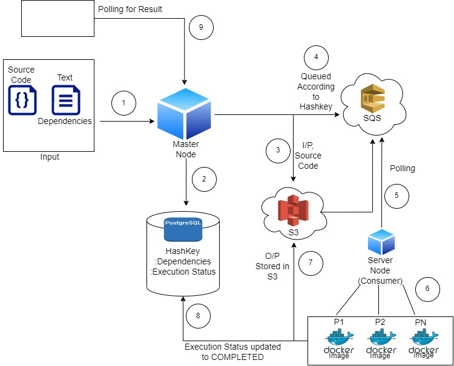

# cmpe_273_group_project

#### project flow:

file i/p genrate unique id => put file in s3 with auto key

consumer => pull code and input from s3 & write output/error => update status to sql

poll api => if done pull & return results 

token, ip, status

https://www.learndatasci.com/tutorials/using-databases-python-postgres-sqlalchemy-and-alembic/
https://dev.to/ivankwongtszfung/safe-update-operation-in-postgresql-using-sqlalchemy-3ela

